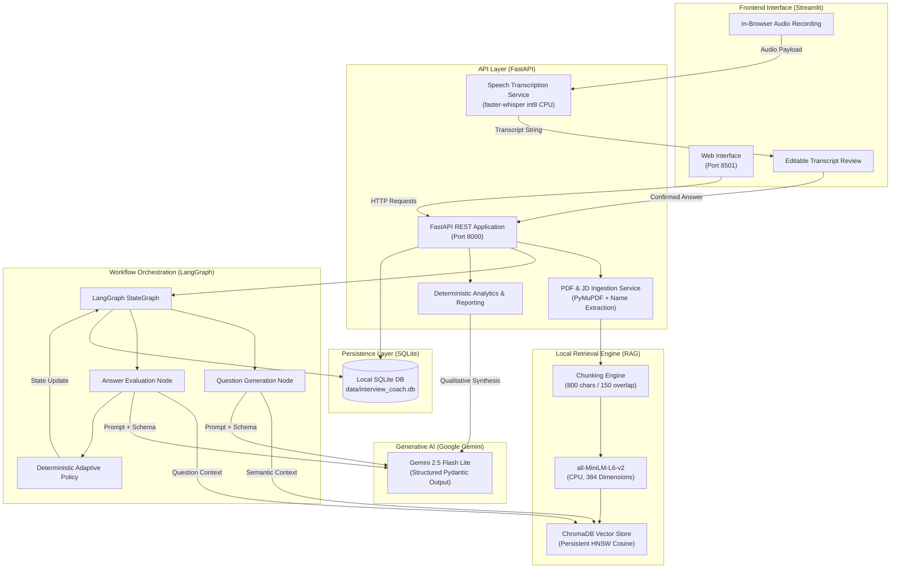
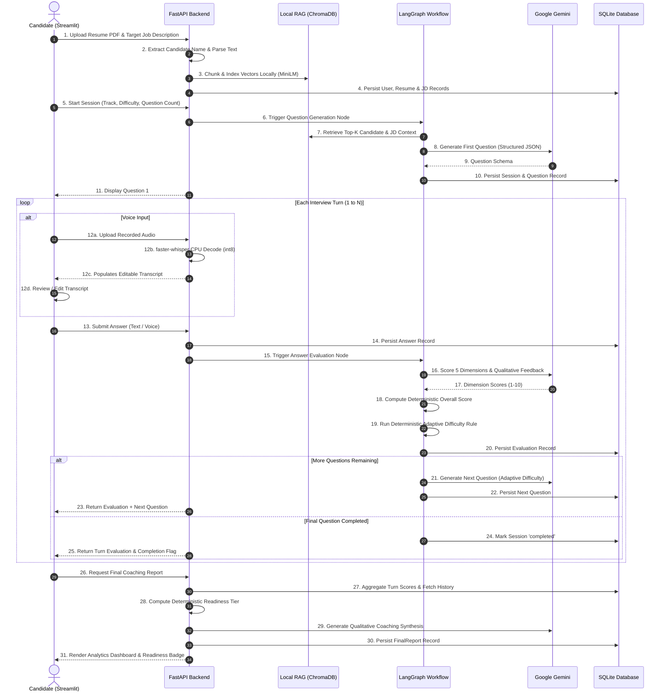
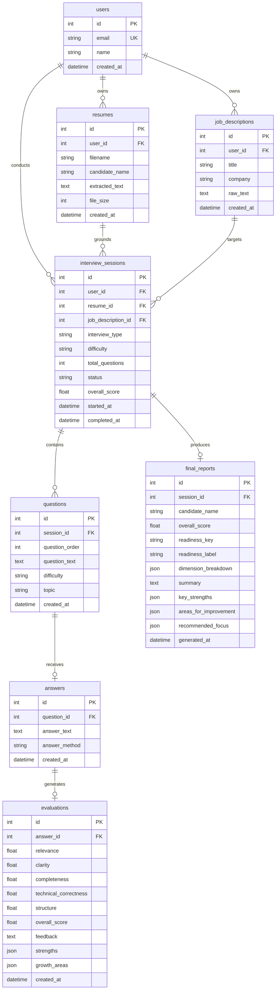
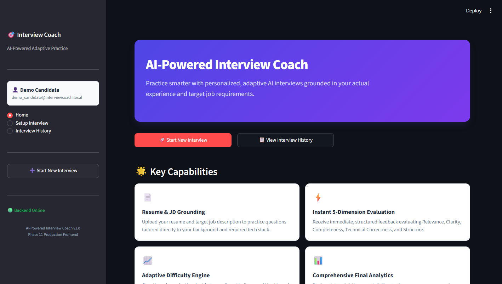
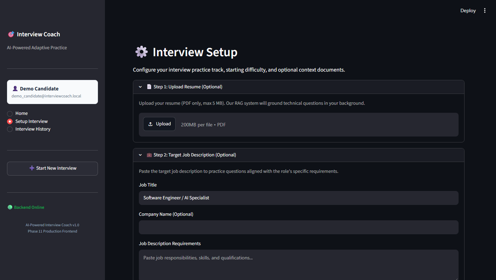
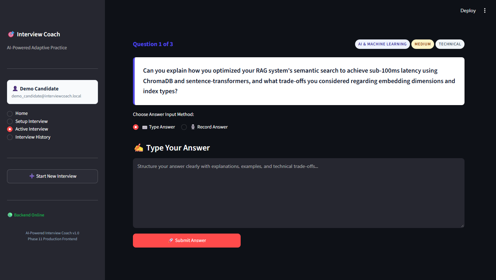
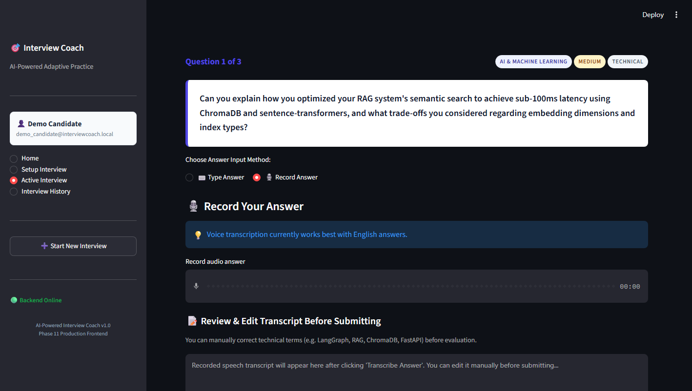
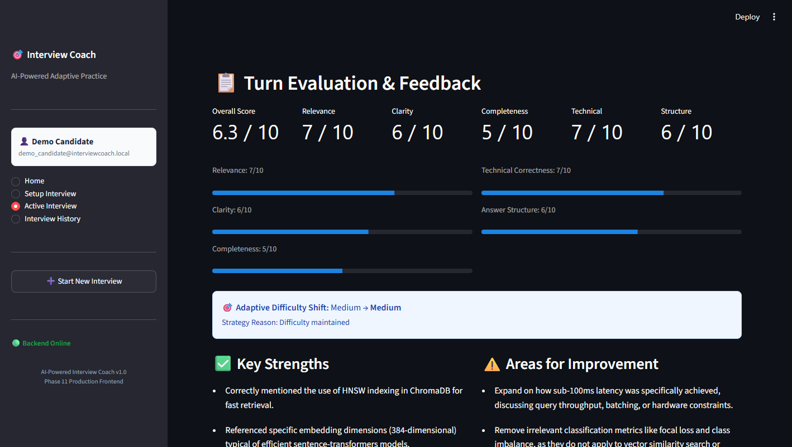
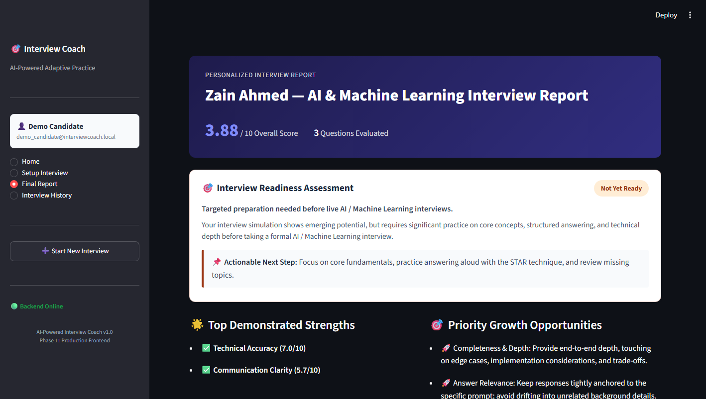
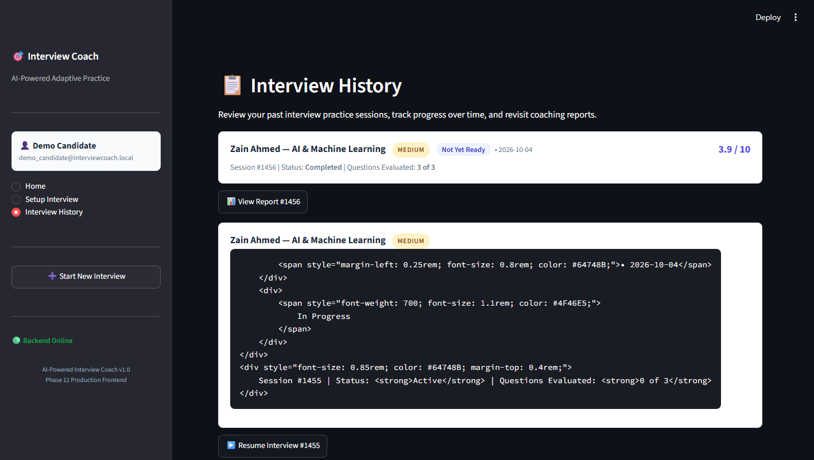

# AI-Powered Interview Coach 🎙️🤖

> **A privacy-first technical interview coaching platform combining multi-turn LangGraph orchestration, local RAG document grounding, deterministic scoring policies, and on-device speech transcription — verified locally with zero paid API dependencies.**

[](https://www.python.org/)
[](https://fastapi.tiangolo.com/)
[](https://streamlit.io/)
[](https://langchain-ai.github.io/langgraph/)
[](https://www.trychroma.com/)
[](https://ai.google.dev/)
[](https://github.com/SYSTRAN/faster-whisper)
[](docs/TESTING.md)

---

## 📑 Table of Contents

- [Executive Summary](#executive-summary)
- [Local-First Architecture & Hosting Disclosure](#local-first-architecture--hosting-disclosure)
- [Documentation Index](#documentation-index)
- [Key Features](#key-features)
- [System Architecture](#system-architecture)
- [End-to-End Interview Workflow](#end-to-end-interview-workflow)
- [Technical Highlights & Engineering Decisions](#technical-highlights--engineering-decisions)
- [Technology Stack](#technology-stack)
- [Database Architecture](#database-architecture)
- [Setup & Installation](#setup--installation)
- [Running the Application](#running-the-application)
- [Step-by-Step User Walkthrough](#step-by-step-user-walkthrough)
- [Local Speech-to-Text Subsystem](#local-speech-to-text-subsystem)
- [Deterministic Adaptive Difficulty](#deterministic-adaptive-difficulty)
- [Answer Evaluation & Scoring Formula](#answer-evaluation--scoring-formula)
- [Readiness Assessment Rubric](#readiness-assessment-rubric)
- [LLM Call Budget & Cost Optimization](#llm-call-budget--cost-optimization)
- [API Overview](#api-overview)
- [Automated Testing & QA](#automated-testing--qa)
- [Security & Privacy Design](#security--privacy-design)
- [UI Gallery](#ui-gallery)
- [Roadmap](#roadmap)
- [License](#license)
- [Author & Acknowledgements](#author--acknowledgements)

---

## 📌 Executive Summary

Modern AI coaching tools frequently suffer from four critical deficiencies:
1. **Unbounded Hallucinations**: Prompt-driven evaluation produces arbitrary grades without objective rubrics or document grounding.
2. **Fragile State Management**: Basic chat interfaces lose conversational context during page refreshes or drop turns when backends restart.
3. **Prohibitive Cloud Costs**: Relying on commercial speech and embedding APIs accumulates compounding API fees for audio ingestion and vector search.
4. **Data Privacy Risks**: Uploaded candidate audio and confidential resumes are stored indefinitely on third-party servers.

The **AI-Powered Interview Coach** solves these challenges by combining **Google Gemini 2.5 Flash Lite** for qualitative semantic analysis with **deterministic Python business logic** for state transitions, scoring, and adaptive difficulty. Combined with **local MiniLM vector embeddings**, **persistent ChromaDB RAG**, and **on-device `faster-whisper` speech transcription**, the platform delivers an authentic interview practice experience using local components for embeddings and speech, paired with free-tier Gemini API usage where available.

---

## 💻 Local-First Architecture & Hosting Disclosure

This repository contains the complete, authoritative, **local-first implementation** of the AI-Powered Interview Coach.

During deployment evaluation under a strict \$0 / zero-card requirement, current public free-tier PaaS providers either impose strict RAM caps (e.g. 512MB) that crash local PyTorch/CTranslate2 inference or require credit card verification. Rather than compromise the system by stripping out on-device speech-to-text or embedding models, this project is delivered as a fully reproducible local system with Docker packaging, exhaustive documentation, real execution evidence, and a video walkthrough.

---

## 📚 Documentation Index

| Document | Description |
|---|---|
| [docs/ARCHITECTURE.md](docs/ARCHITECTURE.md) | In-depth technical architecture, LangGraph state machine, and data flow specifications. |
| [docs/API.md](docs/API.md) | Complete OpenAPI endpoint documentation, request/response JSON schemas, and error codes. |
| [docs/TESTING.md](docs/TESTING.md) | Test suite breakdown across 13 suites (198 tests), mocking strategy, and verification commands. |
| [docs/DEPLOYMENT.md](docs/DEPLOYMENT.md) | Docker containerization, system prerequisites, and local run configurations. |
| [docs/RESOURCE_PROFILE.md](docs/RESOURCE_PROFILE.md) | Benchmarks for memory usage, CPU utilization, and inference latency across subsystems. |
| [docs/FINAL_ACCEPTANCE.md](docs/FINAL_ACCEPTANCE.md) | Formal Phase 13D end-to-end acceptance testing report verifying all 13 runtime checkpoints. |
| [docs/assets/screenshots/README.md](docs/assets/screenshots/README.md) | Visual asset catalog describing all 8 real application screenshots. |
| [docs/GITHUB_PUBLISHING.md](docs/GITHUB_PUBLISHING.md) | GitHub publication guide with recommended repository metadata, topics, and safe git commands. |
| [docs/DEMO_VIDEO.md](docs/DEMO_VIDEO.md) | Timestamped 3-minute demo video storyboard, natural narration script, and recording checklist. |
| [docs/PORTFOLIO_CONTENT.md](docs/PORTFOLIO_CONTENT.md) | CV project entries (standard and 1-line), LinkedIn posts, and recruiter-focused project summaries. |
| [docs/INTERVIEW_GUIDE.md](docs/INTERVIEW_GUIDE.md) | Technical interview preparation guide with 25+ project-specific Q&As, cheat sheets, and debugging stories. |

---

## ✨ Key Features

- **Document-Grounded RAG Pipeline**: Parses candidate resumes (PDF) and target job descriptions, building dense semantic indexes using `sentence-transformers/all-MiniLM-L6-v2` and ChromaDB. Questions probe authentic candidate experience rather than generic templates.
- **Automated Candidate Name Extraction**: Automatically detects and extracts candidate names from uploaded CV headers, personalizing the interview experience and final coaching reports.
- **Stateful Multi-Turn Orchestration (LangGraph)**: Manages interview state transitions through a structured graph state machine. Completed turns, active questions, and evaluations persist directly in SQLite, enabling fault-tolerant session reconstruction across server restarts.
- **Deterministic 5-Dimension Evaluation**: Scores each response across *Relevance*, *Technical Correctness*, *Completeness*, *Clarity*, and *Structure* using deterministic weighted formulas in Python, completely eliminating scoring hallucination.
- **Deterministic Adaptive Difficulty**: Adjusts question challenge dynamically between `easy`, `medium`, and `hard`. Upgrades require strict technical mastery thresholds, preventing sudden difficulty spikes.
- **Objective Interview Readiness Assessment**: Categorizes performance into `Strong Interview Readiness`, `Developing`, or `Not Yet Ready` using fixed mathematical rubrics and weakness-aware dimension ranking.
- **Optional Local Speech-to-Text Input**: Candidates can speak their answers via an in-browser audio recorder. Local `faster-whisper` (int8 CPU) transcribes speech offline with zero audio storage and gives candidates the ability to review and edit before submission.
- **Comprehensive Final Coaching Reports**: Generates turn-by-turn breakdowns, quantitative dimension averages, qualitative strengths, and actionable growth areas. Reports are stored in SQLite and can be retrieved instantly with zero additional LLM costs.
- **Strict Tenant & Session Isolation**: Enforces user-level and document-level isolation across all database queries and vector similarity searches.

---

## 🏗️ System Architecture

The platform separates concerns across a decoupled client interface, REST API backend, state machine orchestrator, local vector store, and SQLite persistence layer:



For full architectural blueprints, data schemas, and component contracts, see [docs/ARCHITECTURE.md](docs/ARCHITECTURE.md).

---

## 🔄 End-to-End Interview Workflow



---

## 💡 Technical Highlights & Engineering Decisions

1. **Why MiniLM?** Local embeddings via `sentence-transformers/all-MiniLM-L6-v2` (384 dimensions) generate vectors on CPU in ~20ms per chunk without recurring cloud API fees or external network latency.
2. **Why ChromaDB?** An embedded vector store with persistent HNSW cosine indexing that runs in-process with zero independent infrastructure management while providing strict multi-tenant metadata filtering.
3. **Why LangGraph?** Encapsulates multi-turn conversational workflow as a formal state machine. Unlike a basic while-loop, state is checkpointed to SQLite at each turn, making interviews resilient to browser refreshes or backend restarts.
4. **Why Deterministic Python Scoring & Readiness?** LLMs excel at qualitative critique but suffer from arithmetic hallucination and anchoring bias. Delegating overall scoring and readiness tier classification to Python weighted formulas guarantees 100% mathematical reproducibility.
5. **Why an Editable Voice Transcript?** Technical acronyms (e.g. LangGraph, ChromaDB, FastAPI) can be misrecognized by speech models. Providing an editable review buffer before answer submission ensures candidate answers are accurately represented prior to grading.
6. **Why SQLite?** Provides embedded, zero-configuration ACID relational storage with foreign key cascade integrity, perfectly suited for local-first execution.
7. **Why Local `faster-whisper`?** Uses CTranslate2 with int8 quantization on CPU for sub-3s transcription with zero raw audio cloud persistence and zero external speech API billing.
8. **Bounded LLM Call Budget ($2N + 1$)**: Exactly $2N + 1$ Gemini API calls are made for an $N$-question session ($N$ questions + $N$ evaluations + 1 final report). No tokens are spent on embeddings, scoring math, or speech transcription.
9. **Privacy-First Audio Handling**: Recorded speech is processed through an ephemeral temporary file and unlinked immediately in a `try...finally` block. No audio recordings persist to disk, database, or external servers.

---

## 🛠️ Technology Stack

| Layer | Technology | Version / Spec | Purpose & Architectural Justification |
|---|---|---|---|
| **Language** | Python | `3.11+` | Modern type hints, high-performance async runtime, and broad ML ecosystem. |
| **API Framework** | FastAPI | `0.115+` | High-throughput asynchronous REST API with automatic OpenAPI validation. |
| **Frontend UI** | Streamlit | `1.42+` | Rapid reactive web interface with integrated audio recording widgets. |
| **State Machine** | LangGraph | `0.2+` | Graph-based multi-turn interview workflow orchestration. |
| **Generative LLM** | Google Gemini | `gemini-flash-lite-latest` | Ultra-fast structured generation and qualitative feedback. |
| **Embeddings** | SentenceTransformers | `all-MiniLM-L6-v2` (384-dim) | High-speed local CPU dense vector embeddings ($0 cost). |
| **Vector DB** | ChromaDB | `0.5+` (Persistent) | Local vector store with HNSW cosine indexing and metadata isolation. |
| **Speech-to-Text** | faster-whisper | `base.en` (int8 CPU) | Highly optimized CTranslate2 Whisper implementation running locally. |
| **PDF Extraction** | PyMuPDF (`fitz`) | `1.24+` | Fast, accurate document parsing preserving layout hierarchy. |
| **Database** | SQLite + SQLAlchemy | `2.0+` | Zero-configuration, zero-dependency durable relational storage. |
| **Validation** | Pydantic | `2.10+` | Runtime type safety and structured LLM output schemas. |

---

## 🗄️ Database Architecture

The SQLite relational database (`data/interview_coach.db`) maintains strict foreign key constraints and cascade integrity across 8 core entities:



---

## ⚙️ Setup & Installation

### Prerequisites
- **Python 3.11+** installed on your system.
- **Git** for version control.
- **Free Google Gemini API Key**: Obtainable from [Google AI Studio](https://aistudio.google.com/).

### 1. Clone the Repository
```bash
git clone https://github.com/your-username/AI-Interview-Coach.git
cd AI-Interview-Coach
```

### 2. Create and Activate Virtual Environment
```powershell
# Windows (PowerShell)
python -m venv .venv
.\.venv\Scripts\Activate.ps1

# Linux / macOS
python3 -m venv .venv
source .venv/bin/activate
```

### 3. Install Dependencies
```bash
pip install --upgrade pip
pip install -r requirements.txt
```

### 4. Configure Environment Variables
Copy the template configuration file:
```powershell
# Windows
Copy-Item .env.example .env

# Linux / macOS
cp .env.example .env
```

Open `.env` in your text editor and add your Google Gemini API key:
```ini
# Core Configuration
APP_NAME=AI-Powered Interview Coach
APP_VERSION=1.0.0
DEBUG=false

# Google Gemini API
GEMINI_API_KEY=your_actual_gemini_api_key_here
GEMINI_MODEL=gemini-flash-lite-latest

# Persistence
DATABASE_URL=sqlite:///./data/app.db
CHROMA_PERSIST_DIRECTORY=./data/vector_store
```

---

## 🚀 Running the Application

The platform consists of two services that run concurrently:

### 1. Launch the FastAPI Backend
In your primary terminal:
```powershell
# Windows PowerShell
.venv\Scripts\uvicorn.exe app.main:app --port 8000 --reload
```
The API documentation is accessible at `http://localhost:8000/docs`.

### 2. Launch the Streamlit Frontend
In a second terminal:
```powershell
# Windows PowerShell
.venv\Scripts\streamlit.exe run frontend/app.py --server.port 8501
```
The web dashboard opens automatically at `http://localhost:8501`.

---

## 🧭 Step-by-Step User Walkthrough

1. **Dashboard Home**: Launch the application. The system automatically initializes a local session for the demo candidate.
2. **Resume Upload**: Upload your resume (PDF). PyMuPDF parses the text, extracts your candidate name (e.g. `Zain Ahmed`), and generates local vector embeddings stored in ChromaDB.
3. **Job Description**: Paste the target job posting (title, company, technical requirements). The text is chunked and indexed into ChromaDB.
4. **Configure Session**:
   - Choose your track: `Python`, `AI / Machine Learning`, `Data Science`, `HR & Behavioral`, or `Internship`.
   - Select initial difficulty: `Easy`, `Medium`, or `Hard`.
   - Set total question count (e.g., 3 to 5 questions).
5. **Live Multi-Turn Interview**:
   - The AI presents Question 1 grounded in your resume and job requirements.
   - Choose your answering method:
     - **Type Answer**: Enter your response in the Markdown text area.
     - **Record Answer**: Speak into your microphone. Click *Transcribe Answer* to run local Whisper inference, review the editable transcript, and make any manual corrections.
   - Click **Submit Answer**.
6. **Instant Qualitative & Quantitative Feedback**:
   - View your 5-dimension score breakdown with strengths and growth areas.
   - Observe adaptive transitions (e.g., performance advances difficulty from `Medium` to `Hard`).
7. **Comprehensive Coaching Report**:
   - Upon completion, receive an overall readiness badge (`Strong Interview Readiness`, `Developing`, or `Not Yet Ready`).
   - Review qualitative feedback, aggregate dimension averages, and recommended focus areas.
8. **Interview History**: Review past sessions, scores, and coaching reports at any time.

---

## 🎙️ Local Speech-to-Text Subsystem

The audio ingestion pipeline guarantees privacy, accuracy, and zero cloud API overhead:

- **Local Inference Engine**: Powered by `faster-whisper` using the quantized `base.en` model running on CPU (`compute_type="int8"`, `cpu_threads=4`).
- **Container Agnostic**: PyAV handles on-the-fly audio demuxing and decoding across `WAV`, `MP3`, `WEBM`, `M4A`, and `OGG`.
- **Ephemeral Storage Lifecycle**: Audio bytes are streamed directly into an ephemeral temporary file, decoded into 16 kHz mono waveforms, and immediately purged in a `finally` block:
  ```python
  try:
      with open(temp_path, "wb") as f:
          f.write(contents)
      segments, _ = model.transcribe(temp_path, language="en")
  finally:
      if os.path.exists(temp_path):
          os.remove(temp_path)
  ```
- **Editable Transcript Review**: Transcripts populate an interactive Streamlit `text_area`, allowing candidates to fix technical terms or acronyms before submission.

---

## 📈 Deterministic Adaptive Difficulty

Difficulty adjustments are driven by deterministic Python rules to prevent erratic swings:

$$\text{Next Difficulty} = f(\text{Overall Score}, \text{Current Difficulty}, \text{Track}, \text{Dimension Scores})$$

| Current Difficulty | Turn Score | Guardrails & Track Conditions | Next Difficulty | Action Taken |
|:---:|:---:|---|:---:|:---:|
| `easy` | $\ge 8.0$ | For technical tracks: $\text{Tech Correctness} \ge 7.0$ & $\text{Completeness} \ge 6.0$ | `medium` | Increased |
| `medium` | $\ge 8.0$ | For technical tracks: $\text{Tech Correctness} \ge 7.0$ & $\text{Completeness} \ge 6.0$ | `hard` | Increased |
| `hard` | $\ge 8.0$ | Any track | `hard` | Maintained (Cap) |
| `medium` | $\le 5.0$ | Any track | `easy` | Decreased |
| `hard` | $\le 5.0$ | Any track | `medium` | Decreased |
| `easy` | $\le 5.0$ | Any track | `easy` | Maintained (Floor) |
| *Any* | $5.0 < \text{Score} < 8.0$ | Standard performance | *Unchanged* | Maintained |

---

## 📊 Answer Evaluation & Scoring Formula

Every candidate response is evaluated across five dimensions on a 1.0 to 10.0 scale:

$$\text{Overall Score} = 0.25 \cdot R + 0.25 \cdot T + 0.20 \cdot C + 0.15 \cdot L + 0.15 \cdot S$$

- **$R$ — Relevance (25%)**: Directness in answering the core question without evasive filler.
- **$T$ — Technical Correctness (25%)**: Factual precision, domain accuracy, and absence of conceptual errors.
- **$C$ — Completeness (20%)**: Thoroughness in addressing all sub-parts of the prompt.
- **$L$ — Clarity (15%)**: Articulation, conciseness, and professional tone.
- **$S$ — Structure (15%)**: Logical organization (e.g. STAR method: Situation, Task, Action, Result).

---

## 🎯 Readiness Assessment Rubric

The final interview readiness level is computed by taking the arithmetic mean of all turn scores:

$$\overline{S} = \frac{1}{N} \sum_{i=1}^N \text{Overall Score}_i$$

```
   0.0                                6.0                    8.0                  10.0
    ├──────────────────────────────────┼──────────────────────┼─────────────────────┤
    │          Not Yet Ready           │      Developing      │   Strong Readiness  │
    │         (Score < 6.0)            │  (6.0 <= Score < 8.0)│ (8.0 <= Score <=10.0)│
```

- **🟢 Strong Interview Readiness** ($\overline{S} \ge 8.0$): Candidate consistently delivers precise, technically sound answers with clear structure.
- **🟡 Developing — More Prep Recommended** ($6.0 \le \overline{S} < 8.0$): Core foundational competencies present, but gaps in technical depth or structure require improvement.
- **🔴 Not Yet Ready** ($\overline{S} < 6.0$): Significant conceptual gaps or incomplete responses; targeted preparation required.

---

## 💰 LLM Call Budget & Cost Optimization

For an $N$-question interview session, the LLM call budget is strictly bounded:

$$\text{Total Gemini API Calls} = 2N + 1$$

| Operation | Engine Used | LLM API Calls | Cost |
|---|---|:---:|:---:|
| Resume & JD Parsing | PyMuPDF | 0 | $0.00 |
| Candidate Name Extraction | Deterministic Python | 0 | $0.00 |
| Vector Embeddings | Local `all-MiniLM-L6-v2` | 0 | $0.00 |
| Vector Similarity Search | Local ChromaDB | 0 | $0.00 |
| Speech-to-Text | Local `faster-whisper` | 0 | $0.00 |
| Question Generation ($N$ turns) | Gemini 2.5 Flash Lite | $N$ | $0.00* |
| Answer Evaluation ($N$ turns) | Gemini 2.5 Flash Lite | $N$ | $0.00* |
| Numerical Scoring & Adaptive Policy | Deterministic Python | 0 | $0.00 |
| Final Qualitative Report | Gemini 2.5 Flash Lite | 1 | $0.00* |
| Historical Report Retrievals | SQLite Cache | 0 | $0.00 |
| **Total Cloud Expense** | | **$2N + 1$** | **$0.00** |

*\*Local components operate without paid APIs. Gemini Developer API usage is designed around the free tier where available; provider quotas and pricing may change.*

---

## 🔌 API Overview

FastAPI provides an interactive OpenAPI schema at `http://localhost:8000/docs`.

| Endpoint | Method | Description |
|---|:---:|---|
| `/health` | `GET` | System health check probe. |
| `/users/demo` | `POST` / `GET` | Provision or retrieve persistent local demo account. |
| `/resumes/upload` | `POST` | Upload PDF resume, extract candidate name, and store record. |
| `/job-descriptions` | `POST` | Persist role requirements and metadata. |
| `/rag/index/resume/{id}` | `POST` | Chunk and index resume into ChromaDB vector store. |
| `/rag/index/job-description/{id}` | `POST` | Chunk and index job description into ChromaDB. |
| `/speech/transcribe` | `POST` | Transcribe audio via local CPU `faster-whisper`. |
| `/interview/sessions/start` | `POST` | Initialize LangGraph session and generate Question 1. |
| `/interview/sessions/{id}/answer` | `POST` | Submit answer, evaluate, adapt difficulty, and fetch next question. |
| `/interview/sessions/{id}/report` | `POST` / `GET` | Generate or retrieve comprehensive final coaching report. |
| `/interview/sessions` | `GET` | Retrieve chronological session history for candidate. |

Full request schemas and JSON payload examples are documented in [docs/API.md](docs/API.md).

---

## 🧪 Automated Testing & QA

The application includes **198 automated test cases across 13 test suites** covering unit, integration, and UI workflows:

```
Ran 198 tests in 21.390s
OK (198/198 PASS, 0 failures, 0 errors, 0 skipped)
```

Run the complete test suite:
```powershell
.venv\Scripts\python.exe -m unittest discover -s tests -p "test_*.py"
```

For test suite breakdowns and mocked isolation strategies, see [docs/TESTING.md](docs/TESTING.md).

---

## 🔒 Security & Privacy Design

- **Zero Remote Audio Persistence**: Spoken audio is decoded in memory, written only to a temporary file, and permanently removed upon transcription completion. No voice recordings are stored in the database or sent to external APIs.
- **Strict Multi-Tenant Isolation**: Database queries and ChromaDB vector lookups enforce `user_id` filtering at the data access layer, preventing data leakage across candidate accounts.
- **Local Secret Storage**: All credentials reside in a git-ignored `.env` file; no hardcoded API keys exist in code.
- **Defensive Error Handling**: API responses never expose local file paths, stack traces, or upstream error payloads to client interfaces.

---

## 🖼️ UI Gallery

The following visual assets were captured directly from the live application during the [Phase 13D Final Acceptance Verification](docs/FINAL_ACCEPTANCE.md):

| Landing Page | Interview Setup |
|:---:|:---:|
|  |  |

| Live Question (Turn 1/3) | Voice Recording Mode |
|:---:|:---:|
|  |  |

| Editable Speech Transcript | Structured Answer Evaluation |
|:---:|:---:|
|  |  |

| Candidate Coaching & Readiness Report | Historical Sessions Audit |
|:---:|:---:|
|  |  |

---

## 🗺️ Roadmap

- [x] **Local Multi-Turn Orchestration & RAG Grounding**: LangGraph state machine with MiniLM + ChromaDB.
- [x] **On-Device Speech-to-Text**: Local `faster-whisper` CPU int8 transcription with an editable transcript review buffer.
- [x] **Containerized Packaging & Verification**: Docker packaging, 198 automated regression tests, and live acceptance verification.
- [ ] **Multi-Modal Video Analysis**: Optional on-device eye contact and pacing feedback via MediaPipe.
- [ ] **Interactive Coding Sandbox**: In-browser Python REPL for live technical coding interviews.
- [ ] **Local LLM Backend**: Optional Ollama integration (e.g. Llama 3 / Mistral) for 100% air-gapped offline operation.

---

## 📄 License

This repository does not currently contain a formal open-source license. All rights are reserved by the author. An open-source license (such as MIT or Apache-2.0) may be selected upon public portfolio distribution.

---

## 👤 Author & Acknowledgements

- **Developer**: AI Engineering Team
- **Generative AI**: Google DeepMind / Google AI Studio for Gemini Flash Lite
- **Speech Engine**: SYSTRAN `faster-whisper`
- **Embeddings**: SentenceTransformers team & Hugging Face
