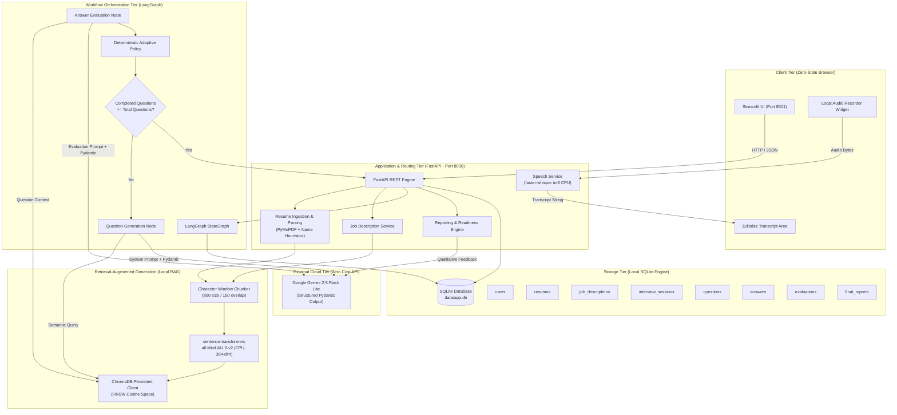
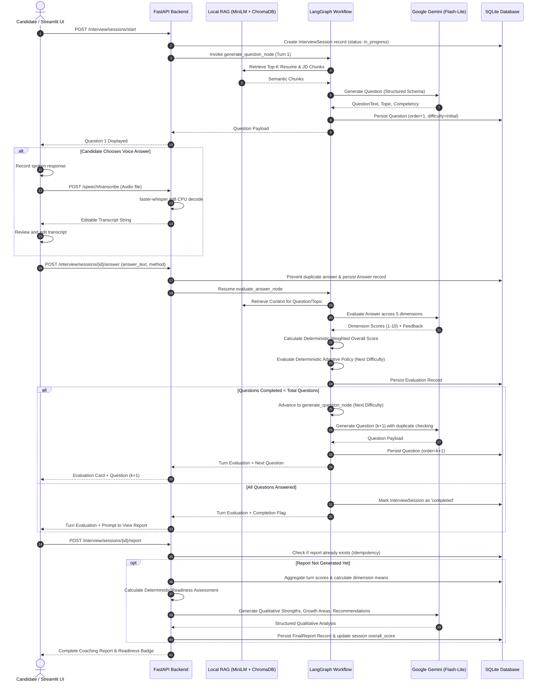

# System Architecture & Technical Specification

The **AI-Powered Interview Coach** is engineered around a hybrid deterministic/probabilistic paradigm: high-level conversational nuance and semantic synthesis are powered by Google Gemini, while state management, difficulty transitions, mathematical scoring, tenant isolation, and speech transcription are strictly deterministic and run locally.

---

## 🏛️ High-Level Architectural Patterns



---

## 🔄 Turn-by-Turn Execution Lifecycle

The interview runs as an asynchronous, multi-turn state machine where every state transition is committed to SQLite before responding to the client:



---

## 🔍 Local RAG Engine Specification

The RAG pipeline operates entirely offline on the local CPU without external embedding APIs or cloud vector infrastructure.

### 1. Document Ingestion & Chunking
- **Resume Parser**: PyMuPDF (`fitz`) extracts raw text, preserving line breaks. An extraction heuristic inspects top lines, skips metadata headers (e.g. `CURRICULUM VITAE`, `RESUME`), and isolates the candidate's real name.
- **Job Description Ingestion**: Raw text normalized for Unicode punctuation and whitespace.
- **Chunker Parameters**:
  - `chunk_size = 800` characters.
  - `chunk_overlap = 150` characters.
  - Natural splitting delimiters: `["\n\n", "\n", ". ", "? ", "! ", " ", ""]`.

### 2. Local Dense Embedding Model
- **Model**: `sentence-transformers/all-MiniLM-L6-v2`.
- **Dimensions**: `384` floating-point values.
- **Execution Device**: `cpu` (using PyTorch CPU runtime).
- **Normalization**: Embeddings are $L_2$-normalized to ensure inner product equivalence with cosine similarity.

### 3. Persistent Vector Store (ChromaDB)
- **Client**: `chromadb.PersistentClient(path="./data/vector_store")`.
- **Collection Name**: `interview_documents`.
- **Distance Metric**: Cosine space via HNSW metadata: `{"hnsw:space": "cosine"}`.
- **Metadata Filters**:
  Every chunk indexed includes strict isolation tags:
  ```json
  {
    "user_id": 1,
    "document_type": "resume",
    "document_id": 1,
    "chunk_index": 0
  }
  ```
- **Retrieval Guard**: Query filtering mandates matching `user_id`, preventing any cross-user data leakage.

---

## 🤖 LangGraph State Machine & Orchestration

The interview workflow is modeled using LangGraph `StateGraph` with a defined Pydantic state schema:

```python
class InterviewState(TypedDict):
    session_id: int
    user_id: int
    interview_type: str
    target_difficulty: str
    total_questions: int
    current_question_order: int
    completed_question_count: int
    rag_context: List[str]
    current_question: Optional[Dict[str, Any]]
    current_answer: Optional[str]
    current_evaluation: Optional[Dict[str, Any]]
    previous_questions: List[str]
    is_completed: bool
```

### State Reconstruction from SQLite
LangGraph workflows are stateless across HTTP requests. When `POST /interview/sessions/{session_id}/answer` is received:
1. The session, all questions, answers, and evaluations are retrieved from SQLite.
2. The `InterviewState` dictionary is reconstructed with the complete historical transcript.
3. The graph executes the pending turn and writes back the updated state to SQLite.
4. **Resilience**: If the server crashes mid-session, no in-memory state is lost; the session resumes cleanly from SQLite upon the next turn submission.

---

## ⚖️ Scoring Formulation & Deterministic Policies

To guarantee fairness and prevent LLM hallucination in quantitative scoring, all numerical calculations are performed in deterministic Python.

### 1. 5-Dimension Evaluation Formula
Gemini scores each dimension on a 1.0 to 10.0 scale with strict rubrics. The overall turn score is calculated via:

$$\text{Overall Score} = 0.25 \cdot \text{Relevance} + 0.25 \cdot \text{Technical Correctness} + 0.20 \cdot \text{Completeness} + 0.15 \cdot \text{Clarity} + 0.15 \cdot \text{Structure}$$

### 2. Deterministic Adaptive Difficulty Policy
Difficulty transitions are driven purely by Python logic, avoiding erratic LLM adjustments:

| Turn Overall Score | Conditions | Action | Transition Rule |
|---|---|---|---|
| **$\ge 8.0$** | Technical track (`python`, `ai_ml`, `data_science`) requires $\text{Technical Correctness} \ge 7.0$ and $\text{Completeness} \ge 6.0$ | **Increase (+1 Level)** | `easy` $\to$ `medium`<br>`medium` $\to$ `hard`<br>`hard` $\to$ `hard` (Maintains top tier) |
| **$\ge 8.0$** | Fails technical guardrail ($\text{Tech} < 7.0$ or $\text{Comp} < 6.0$) | **Maintain** | Logs guardrail explanation |
| **$\le 5.0$** | Any interview track | **Decrease (-1 Level)** | `hard` $\to$ `medium`<br>`medium` $\to$ `easy`<br>`easy` $\to$ `easy` (Maintains base tier) |
| **$5.0 < \text{Score} < 8.0$** | Consistent performance within standard bounds | **Maintain** | Difficulty remains identical |

### 3. Interview Readiness Assessment Rubric
Final interview readiness is computed across the mean overall score of all session turns:

| Mean Score Range | Readiness Category | Display Badge | Description |
|---|---|---|---|
| **$8.0 \le \text{Score} \le 10.0$** | `strong_readiness` | 🟢 Strong Interview Readiness | Candidate demonstrates robust mastery, clear communication, and consistent technical depth. |
| **$6.0 \le \text{Score} < 8.0$** | `developing` | 🟡 Developing — More Prep Recommended | Candidate possesses core foundational knowledge but has gaps in depth, completeness, or structure. |
| **$\text{Score} < 6.0$** | `not_yet_ready` | 🔴 Not Yet Ready | Fundamental concepts missing; requires targeted practice before live candidate interviews. |

#### Weakness-Aware Tie-Breaking
When identifying primary areas for growth, dimensions with identical low scores are ranked according to a deterministic recruiter priority hierarchy:
1. `relevance` (Most critical: answering the actual question asked)
2. `clarity` (Communicating clearly without ambiguity)
3. `completeness` (Covering core requirements)
4. `technical_correctness` (Domain accuracy)
5. `structure` (Systematic response framework)

---

## 🎙️ Speech-to-Text Subsystem

The voice answer pipeline is designed for local processing, low latency, and zero data leakage:

```
[Browser Audio Recording]
       │  (WebM / WAV / MP3 bytes via HTTP POST)
       ▼
[FastAPI /speech/transcribe]
       │
       ├─► 1. Save stream to temporary file (.tmp)
       ├─► 2. Load PyAV audio container & resample to 16 kHz mono
       ├─► 3. faster-whisper (base.en, CPU int8, 4 threads)
       ├─► 4. Generate transcript text
       ├─► 5. finally: os.remove(temp_path) [Zero raw audio retained]
       │
       ▼
[JSON TranscriptionResponse]
       │
       ▼
[Streamlit Editable text_area]
       │  (Candidate reviews, edits, and verifies)
       ▼
[Submit Answer to LangGraph]
```

### Privacy & Resource Guarantees
- **Zero Cloud Costs**: Uses open-source `faster-whisper` running locally on CPU.
- **Immediate Cleanup**: Temporary audio files are purged in a `try...finally` block immediately after transcription. No audio is ever stored in SQLite or on disk.
- **User Agency**: Transcripts are returned to an editable text box. Candidates can fix misheard jargon or technical acronyms before submitting.

---

## 📊 LLM Call Budget & Cost Optimization

For an $N$-question interview session, the LLM call budget is strictly bounded:

$$\text{Total Gemini API Calls} = 2N + 1$$

- $N$ calls for question generation.
- $N$ calls for multi-dimension answer evaluation.
- $1$ call for final qualitative coaching synthesis.

| Subsystem Component | Processing Engine | Cost / Call |
|---|---|---|
| PDF Text Extraction | Local PyMuPDF (`fitz`) | $0.00 |
| Candidate Name Extraction | Local Regex & Heuristics | $0.00 |
| Document Chunking | Local Recursive Character Splitter | $0.00 |
| Vector Embeddings | Local `all-MiniLM-L6-v2` | $0.00 |
| Vector Similarity Search | Local ChromaDB (HNSW Cosine) | $0.00 |
| Speech-to-Text | Local `faster-whisper` (int8 CPU) | $0.00 |
| Overall Score Calculation | Deterministic Python Formula | $0.00 |
| Adaptive Difficulty Policy | Deterministic Python State Machine | $0.00 |
| Readiness Tier Calculation | Deterministic Python Thresholds | $0.00 |
| Report Re-Retrieval | SQLite Cache (Idempotent) | $0.00 |
| **Total Cloud Expense** | **Google Gemini Free Tier** | **$0.00** |

---

## 🛡️ Fault Tolerance & Resilience

1. **Gemini 429 Quota Handling**: Backoff retry wrapper with exponential jitter handles temporary cloud rate limits.
2. **Strict AFC Elimination**: Prompts and Pydantic schemas avoid automatic function calling triggers that cause 502 Bad Gateway responses on older endpoints.
3. **Orphan Session Handling**: Database startup checks reconcile sessions marked `in_progress` during server restarts.
4. **Graceful Fallbacks**: If RAG produces empty context, question generation seamlessly defaults to domain-specific curriculum standards.
